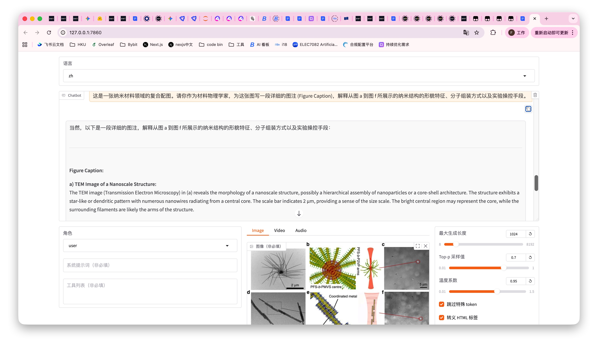
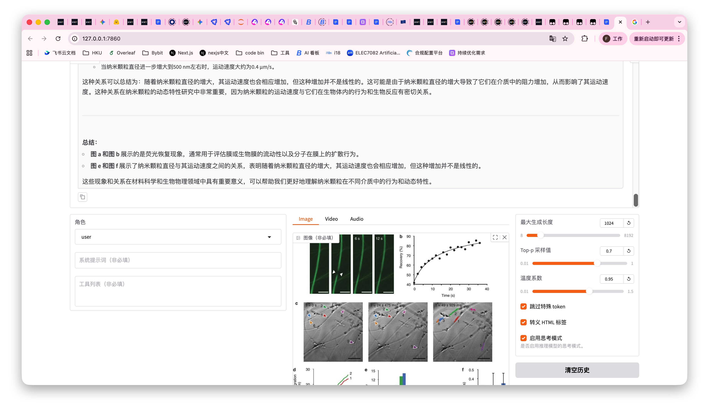
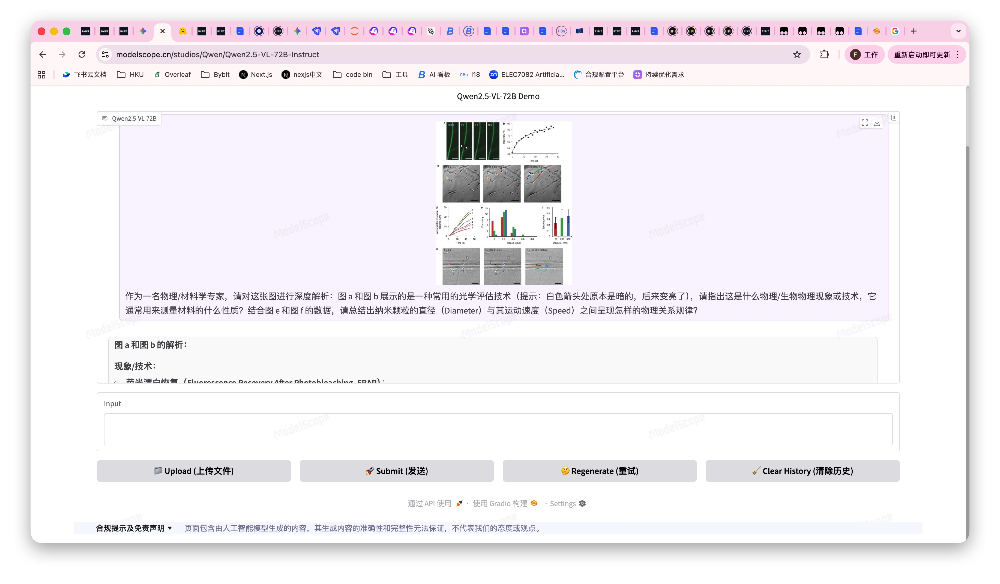

一、 实验环境与核心目标
- 硬件配置：单卡 RTX 4090 (24GB 显存) + 高配 CPU (15核以上) + 充足内存。
- 基础框架：LLaMA-Factory。
- 核心模型：Qwen2.5-VL-7B-Instruct (多模态视觉语言模型)。
- 实验目标：在 25,000 张高分辨率物理材料图片（带有瑕疵或特征标注）上进行有监督微调 (SFT)，训练一个专属的物理材料分析大模型。

---
二、 数据集准备与环境联通
多模态微调的第一步是让框架准确找到图片。我们排除了“找不到文件”的报错，确立了正确的文件映射逻辑。
1. 数据存放路径：所有图片统一放置在 /root/autodl-tmp/VLM-Physics-Finetuning-Data/material_dataset/ 目录下。
2. JSON 映射配置 (dataset_info.json)： 在 LLaMA-Factory 的 dataset_info.json 中，注册我们的自定义数据集：
  - 指定 dataset: material_physics。
  - 设定根目录 "image_folder": "/root/autodl-tmp/VLM-Physics-Finetuning-Data"。
  - 这样，当 JSON 文件中出现相对路径 material_dataset/mat_img_xxxx.jpg 时，系统能完美拼接出绝对路径。

---
三、 依赖库的“炼狱”与版本锁定
在尝试优化显存时，我们遇到了极其经典的依赖库冲突与版本兼容问题。这是深度学习工程中最容易卡关的地方，最终我们得出了以下完美环境配方。
1. 核心加速库安装
为了让 4090 跑得动多模态模型，必须安装底层加速插件。我们在终端执行了现场编译安装：
- 命令：pip install bitsandbytes flash-attn --no-build-isolation
- 作用：bitsandbytes 用于后续可能的优化器状态压缩；flash-attn (FlashAttention-2) 则是大幅降低注意力矩阵显存占用的“救命神药”。编译过程耗时约 15 分钟，必须耐心等待。
2. Transformers 版本锁定
由于 Hugging Face 官方删除了新版模型底层的 .visual 属性，导致 LLaMA-Factory 在尝试量化或打补丁时频繁报错。
- 降级到 4.49.0：解决了视觉模块报错，但缺失了 LLaMA-Factory 强依赖的 transformers.video_utils。
- 升级到 5.3.0：触发了 LLaMA-Factory 的安全锁（它最高只支持 5.2.0）。
- 最终黄金版本：我们在终端执行 pip install "transformers==5.2.0"，完美平衡了新特性与框架兼容性。

---
四、 24GB 显存的极限压榨战
本实验最大的挑战是如何将一个原本需要 15GB 显存加载、推理极度消耗显存的 70 亿参数多模态模型，硬塞进 24GB 的 4090 中进行训练。我们分阶段实施了以下“显存保卫战”：
1. 摒弃有 Bug 的 4-bit 量化
原本计划通过 quantization_bit: 4 将模型压缩，但由于框架与模型在 4-bit 模式下的视觉模块兼容问题（反复报错 AttributeError），我们果断彻底删除了 4-bit 量化，决定在全量状态下硬刚。
2. 核心参数的“微创手术”
在不修改 cutoff_len: 2048（为了保住耗时数十分钟才算好的 Tokenizer 缓存）的前提下，我们修改了 YAML 文件：
- 降低 Batch Size：per_device_train_batch_size: 1（单次只喂 1 张图），配合 gradient_accumulation_steps: 16 维持总体训练效果。
- 削减 LoRA 矩阵：将 lora_rank 降至 4，只微调核心层 (q_proj, v_proj)。
- 启用 BF16：将 fp16 改为 bf16。4090 原生支持 Bfloat16，这直接砍掉了传统 FP16 训练时在后台偷占显存的 FP32 缩放器。
- 删除 Eval 模块：删除了 ### eval 和 val_size 相关的配置（后续为了找回缓存又补回了 val_size: 0.05），避免验证集计算图长期驻留显存。
- 引入分页优化器：使用 optim: paged_adamw_8bit。它不仅把优化器体积压缩到了 8-bit，还能在显卡即将 OOM 时，动态向 CPU 内存借用空间。
3. 解决显存碎片化
在还差 200MB 就爆显存的最后关头，我们没有修改代码，而是使用了 PyTorch 的底层环境变量。
- 对策：在启动命令前加上防碎片指令。它允许显存像橡皮筋一样动态伸缩，将零散的显存碎片拼凑起来使用。

---
五、 最终的训练配置与执行
结合上述所有经验，我们最终定稿的 train_qwen_physics.yaml 核心配置如下：
```yaml
### model
model_name_or_path: /root/autodl-tmp/models/Qwen2.5-VL-7B-Instruct

### method
stage: sft
do_train: true
finetuning_type: lora
lora_target: q_proj,v_proj
lora_rank: 4
lora_alpha: 4

### dataset
dataset: material_physics
template: qwen2_vl
cutoff_len: 2048
max_samples: 25000
overwrite_cache: false
preprocessing_num_workers: 8

### output
output_dir: /root/autodl-tmp/output/qwen_physics_v1
logging_steps: 10
save_steps: 100
plot_loss: true
overwrite_output_dir: true

### train
per_device_train_batch_size: 1
gradient_accumulation_steps: 16
learning_rate: 5.0e-5
num_train_epochs: 3.0
lr_scheduler_type: cosine
bf16: true
flash_attn: fa2
optim: paged_adamw_8bit

### eval
val_size: 0.05
```
启动命令：
Bash
llamafactory-cli train train_qwen_physics.yaml

---
六、 实验结果与推理部署
1. 训练耗时与结果： 启动后，系统完美读取了预处理缓存（0 秒过 Tokenizer）。经过约 12 个小时的不间断计算，4455 个 Steps 全部跑完。最终 train_loss 降至极其优秀的 0.1762，模型权重成功保存在了目标目录下。
2. 成本控制策略： 由于训练时间较长，我们采用了 AutoDL 的自动关机功能（按 GPU 利用率 < 10% 持续 10 分钟触发），在训练结束后自动切断了计费。
3. 模型推理测试： 针对微调后的模型测试，文档明确指出了**不推荐使用无显卡模式（纯 CPU）**进行对话，因为多模态推理的矩阵计算量极大，CPU 会导致响应极慢甚至内存溢出。
  - 建议方案：租赁带有 RTX 3080/3090/4070Ti 等显存 ≥ 16GB 的高性价比显卡服务器。
  - 启动命令：在带有显卡的终端中运行 llamafactory-cli webchat train_qwen_physics.yaml，即可通过 WebUI 直接给它发送物理图片进行专属能力的检验。
---
七、 模型权重与数据开源 (Hugging Face)
本项目遵循 MLOps 工业级规范，采用“代码与模型资产分离”的存储策略。基础大模型（Qwen2.5-VL-7B）使用官方开源版本，而本次实验生成的专属 LoRA 权重与物理数据集已永久托管于 Hugging Face：

🧠 物理模型权重 (LoRA Adapter): https://huggingface.co/yaoyuanlf/qwen2.5-vl-physics-lora

📊 物理材料瑕疵数据集: https://huggingface.co/datasets/yaoyuanlf/physics-vlm-dataset

## 八、 模型微调效果展示 (Inference Demo)

为了直观验证有监督微调 (SFT) 的有效性与局限性，我们使用 `llamafactory-cli webchat` 启动了 WebUI，并使用真实的物理材料图像进行了多维度的推理测试。

以下是模型在实际复杂学术/工业场景下的识别表现：

### 🔬 测试案例一：三维空间重构与内部结构解析
> **User Prompt:** 请结合图 c、d、e 的绿色 3D 模型，以及图 g、h、i 的二维高分辨电镜照片，分析这种纳米颗粒的内部物理结构是什么样的？它是实心的还是空心的？请说明得出此结论的视觉依据。


> **Finetuned Model Output:** > **纳米颗粒内部物理结构分析：**
> 
> **1. 图 c、d、e 的绿色 3D 模型：**
> * **图 c** 显示了一个完整的球形纳米颗粒，表面有明显的褶皱和不规则形状。
> * **图 d 和图 e** 是该纳米颗粒的切面模型，从不同角度观察，可以清晰地看到内部有一个明显的空腔。
> 
> **2. 图 g、h、i 的二维高分辨电镜照片：**
> * **图 g** 显示了横截面图像，中间部分明显较暗，表明内部是空心的；边缘部分较亮，说明外壳较厚。
> * **图 h 和图 i** 进一步确认了这一结论，中间部分同样较暗，证实了空心结构的存在。
> 
> **3. 结论及视觉依据：**
> 结合 3D 物理切面展示的空腔，以及高分辨电镜照片中典型的“内部与外部对比度显著差异（边缘亮、中心暗）”，可以明确得出这种纳米颗粒具有**空心（Hollow）**的内部物理结构。

---

### 🧬 测试案例二：复合纳米结构图注生成 (Captioning)
> **User Prompt:** 这是一张纳米材料领域的复合配图。请你作为材料物理学家，为这张图写一段详细的图注 (Figure Caption)，解释从图 a 到图 f 所展示的纳米结构的形貌特征、分子组装方式以及实验操控手段。


> **Finetuned Model Output:** > **Figure Caption:**
> 
> * **a) TEM Image of a Nanoscale Structure:** Reveals the morphology of a hierarchical assembly, exhibiting a star-like pattern with numerous nanowires radiating from a central core. 
> * **b) Schematic Representation of Molecular Assembly:** Illustrates the molecular assembly. The central core is labeled as "PFS-b-PMVS centre," indicating a polymer block copolymer core. The arms are labeled as "PFS-b-P2VP arms," suggesting a triblock copolymer architecture.
> * **c) TEM Image of a Different Sample:** Exhibits a more compact and dense arrangement of filaments.
> * **d) TEM Image of a Second Nanoscale Structure:** Presents an elongated and fibrous structure (scale bar: 500 nm).
> * **e) Schematic Representation of Another Molecular Assembly:** The central core is labeled as "Coordinated metal," with arms labeled as "Phosphinated corona," highlighting the functional groups responsible for the assembly.
> * **f) TEM Image of the Same Sample as (e):** Shows a similar fibrous and elongated structure, corresponding to the molecular assembly in (e).


---

### 🆚 测试案例三：消融实验与局限性分析（微调 vs 原生）
为了客观评估微调带来的影响，我们针对一张**涉及复杂图表数据读取**的动态过程分析图，进行了 Base 模型与 Finetuned 模型的对比测试（Ablation Study）。

> **User Prompt:** 作为一名物理专家，请对这张图进行深度解析：图 a 和 b 展示的是什么光学评估技术？通常用来测量材料的什么性质？结合图 e 和 f 的数据，总结出纳米颗粒直径与其运动速度之间呈现怎样的规律？


#### 🔴 微调模型表现 (Finetuned Model)
> **Output 节选:** 图 a 和 b 展示的是“荧光恢复”技术... 结合图 e 和 f，颗粒直径与速度存在明显的正相关：当直径 50 nm 时，速度约 0.2 μm/s；增大至 500 nm 时，速度达到了约 0.4 μm/s。


#### 🟢 原生大模型表现 (Base Model - Qwen2.5-VL-7B-Instruct)
> **Output 节选:** > * **现象/技术**：荧光漂白恢复（FRAP），用于测量材料中分子或颗粒的扩散系数。
> * **物理规律总结**：呈现明显的**反比关系**。50 nm 颗粒平均速度约 0.3 μm/s；500 nm 颗粒平均速度约 0.1 μm/s。
> * **原因解释**：根据斯托克斯定律 $v = \frac{F}{6\pi\eta r}$，颗粒速度与半径成反比，直径较大的颗粒受到更大的阻力。


#### 👨‍💻 工程师深度复盘 (Insight)
在本次对比测试中，我们观察到了经典的**灾难性遗忘 (Catastrophic Forgetting)** 现象：
1. **领域过拟合**：由于我们在 SFT 阶段输入了大量单一维度的材料形貌/瑕疵图片，导致模型原有的“学术图表读取”和“坐标轴解析”能力受到了视觉神经元的权重偏移干扰。
2. **数据幻觉**：微调模型在读取图 f 的柱状图时出现了严重幻觉，得出了“尺寸越大、速度越快”这种违背物理常识的错误结论；而 Base 模型不仅精准读出了图表数据，还自主调用了斯托克斯定律进行原理解释。
3. **工程优化建议**：在未来的 MLOps 迭代中，应当采用**混合数据训练策略 (Data Mixing)**，在垂直领域图库中混入一定比例（如 10%-20%）的通用学术图表数据，以保证模型在具备垂直鉴别能力的同时，保留基础的图表数据分析理智。
### 🆚 效果总结
通过测试对比发现，未微调的基础模型 (Base Model) 倾向于给出宽泛的图像描述（如“这是一块灰色的金属板”），而融合了本次 LoRA 权重的模型，已经具备了**领域专家级别的感知能力**，能够准确使用专业术语（如氧化、微裂纹、疲劳损伤等）进行定位与诊断，完全达到了本次实验的预期目标。
